<p align="center">
  
</p>

<p align="center">
  <a href="https://git.io/typing-svg">
    
  </a>
</p>

<p align="center">
  
  
  
  
  
</p>

---

## ✦ Something Has Been Steeping

**The XVIII Brew Co.** is a premium digital storefront designed for the modern connoisseur. Experience single-origin beans, precision brewing, and handcrafted confections presented in a visual experience that mirrors the craftsmanship of our coffee.

This application is built as a state-of-the-art Single Page Application (SPA) utilizing **Next.js 16 (App Router)**, **React 19**, **Tailwind CSS v4**, and **Framer Motion** for a smooth, editorial-grade user interface.

---

## 🌟 Key Features

<details open>
  <summary><strong>☕ Premium Digital Menu</strong> (Click to collapse)</summary>
  <ul>
    <li>Explore single-origin coffee collections and signature desserts with detailed product view cards.</li>
    <li>High-resolution responsive imagery with staggered gallery animations.</li>
    <li>Filterable menus for quick access to Hot Coffee, Cold Brews, Cakes, and Tarts.</li>
  </ul>
</details>

<details>
  <summary><strong>🔐 Phone OTP Authentication</strong></summary>
  <ul>
    <li>Firebase-powered authentication featuring secure phone numbers and SMS OTP verification.</li>
    <li>Recaptcha confirmation overlay designed inside custom Radix UI modals.</li>
    <li>State persistence with custom React Hooks synced to the store.</li>
  </ul>
</details>

<details>
  <summary><strong>🛒 Real-Time Cart &amp; Rewards Store</strong></summary>
  <ul>
    <li>Zustand-powered state management to handle shopping cart interactions instantly without page refreshes.</li>
    <li>Interactive rewards page tracking customer loyalty points and unlockable signature menu items.</li>
  </ul>
</details>

<details>
  <summary><strong>👑 Editorial design &amp; smooth motions</strong></summary>
  <ul>
    <li>Bespoke editorial grid layouts styled with custom gold-bronze tones (<code>#B8956A</code>) and warm dark backdrops (<code>#15110D</code>).</li>
    <li>Framer Motion physics leveraging custom cubic-bezier ease settings <code>[0.22, 1, 0.36, 1]</code> for organic transitions.</li>
  </ul>
</details>

---

## 🛠 Tech Stack

- **Core Framework**: [Next.js 16 (App Router)](https://nextjs.org) &amp; [React 19](https://react.dev)
- **Styling**: [Tailwind CSS v4](https://tailwindcss.com) (leveraging modern `@tailwindcss/postcss`)
- **Animations**: [Framer Motion](https://www.framer.com/motion/) for micro-interactions, layout transitions, and editorial typography animations.
- **State Management**: [Zustand](https://github.com/pmndrs/zustand) for reactive cart &amp; authentication stores.
- **Backend / Authentication**: [Firebase Auth](https://firebase.google.com/docs/auth) with SMS-based Phone verification.
- **UI Primitives**: [Radix UI](https://www.radix-ui.com/) for fully accessible dialogs, portals, and menus.
- **Iconography**: [Lucide React](https://lucide.dev)

---

## 🚀 Getting Started

To spin up the development server locally, follow the animated command logs or setup guide below:

<p align="center">
  
</p>

### 1. Prerequisites
- **Node.js**: `v20.x` or above recommended
- **npm** / **yarn** / **pnpm**

### 2. Set Up Environment Variables
Create a file named `.env.local` in the root of the project and populate it with your Firebase configuration parameters:

```env
# Firebase Client Configuration (Phone Auth Setup)
NEXT_PUBLIC_FIREBASE_API_KEY=your_api_key_here
NEXT_PUBLIC_FIREBASE_AUTH_DOMAIN=your_project_id.firebaseapp.com
NEXT_PUBLIC_FIREBASE_PROJECT_ID=your_project_id
NEXT_PUBLIC_FIREBASE_STORAGE_BUCKET=your_project_id.appspot.com
NEXT_PUBLIC_FIREBASE_MESSAGING_SENDER_ID=your_messaging_sender_id
NEXT_PUBLIC_FIREBASE_APP_ID=your_app_id
```

### 3. Installation &amp; Execution

```bash
# Clone the repository
git clone https://github.com/RegalxCoding/XVIII-FRONTEND.git
cd XVIII-FRONTEND

# Install dependencies
npm install

# Run the development server
npm run dev
```

Open [http://localhost:3000](http://localhost:3000) on your browser to view the application.

---

## 📁 Repository Structure

```bash
src/
├── app/                  # Next.js 16 Pages & Routing
│   ├── about/            # Story and philosophy pages
│   ├── admin/            # Admin order manager interface
│   ├── cart/             # Checkout and order review
│   ├── login/            # Phone authentication gate
│   ├── menu/             # Coffee & dessert digital menu
│   └── product/          # Detailed product view pages
├── components/           # Shared & layout UI elements
│   ├── auth/             # Login forms and OTP components
│   ├── layout/           # Navbar, Footer, and responsive menus
│   └── sections/         # Home page editorial sections (Hero, Process, Rewards)
├── store/                # Zustand global state (Auth, Cart store)
├── services/             # Firebase integration layer & API services
├── hooks/                # Custom React Hooks (e.g. useAuth)
├── lib/                  # Initialized SDKs (Firebase Client config)
└── types/                # Shared TypeScript Type definitions
```

---

## ⚙️ Build and Production

To package the client application for production deployment:

```bash
# Lint the codebase
npm run lint

# Build the optimized production bundle
npm run build

# Start production server locally
npm run start
```

---

<p align="center">
  <sub>Designed with precision. Crafted for the extraordinary. © 2026 The XVIII Brew Co.</sub>
</p>
